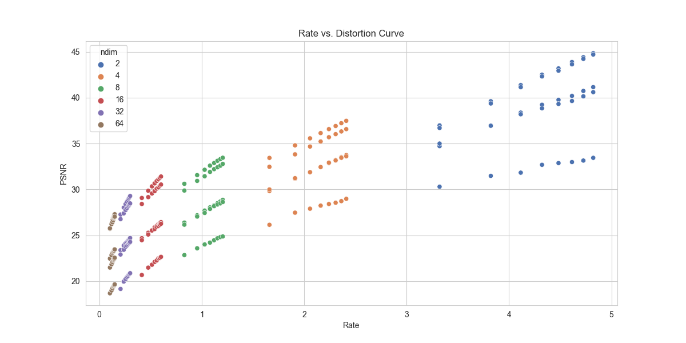
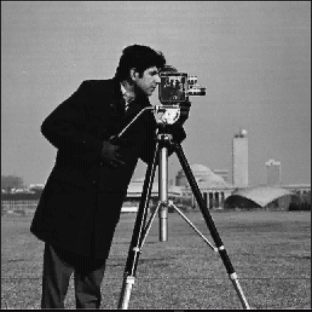
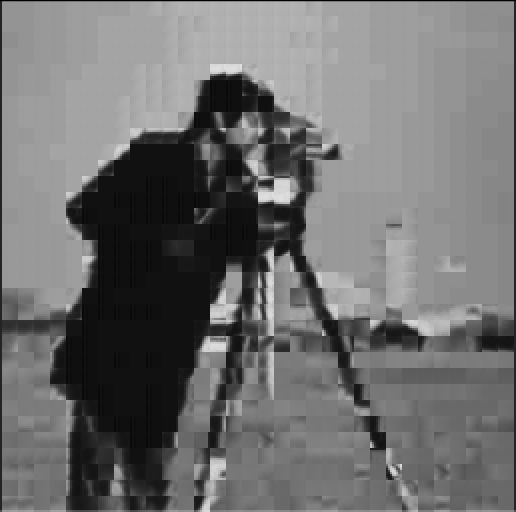
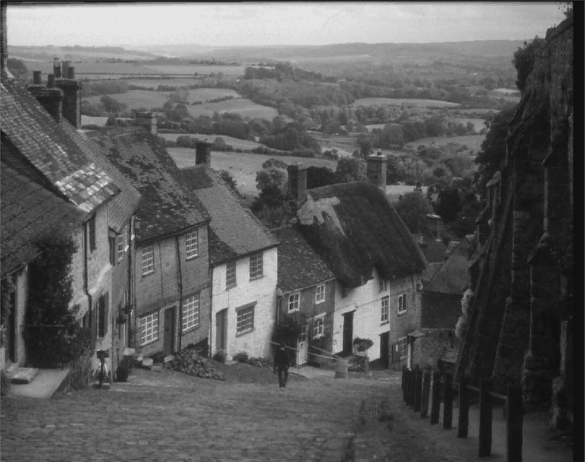
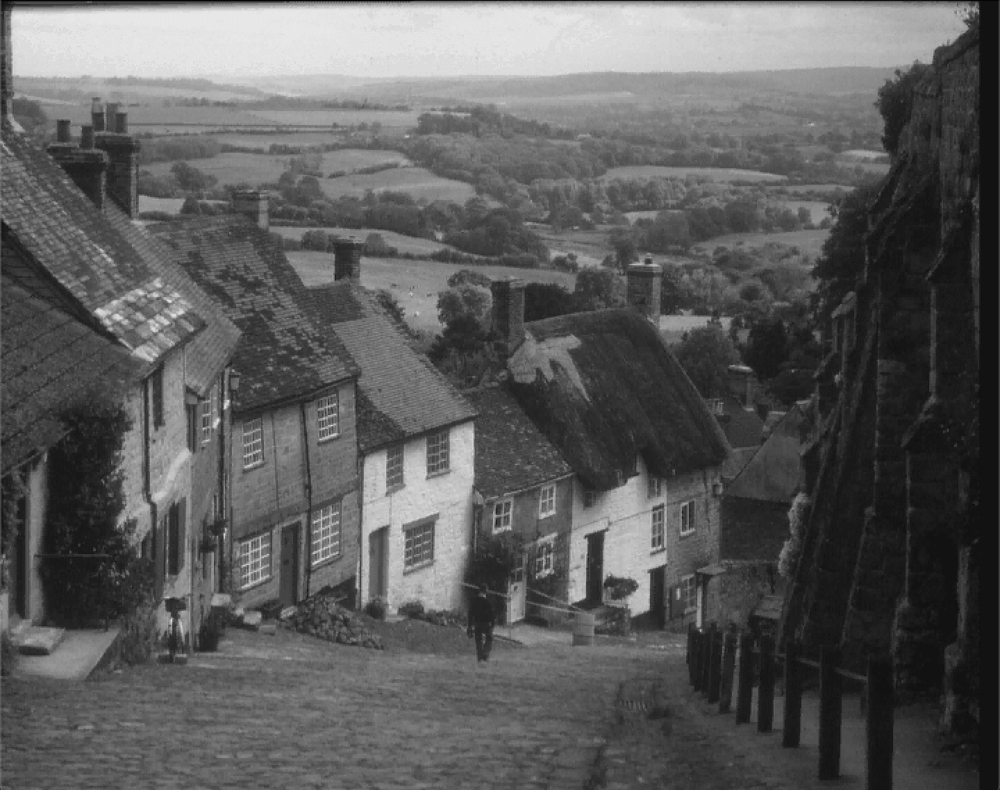
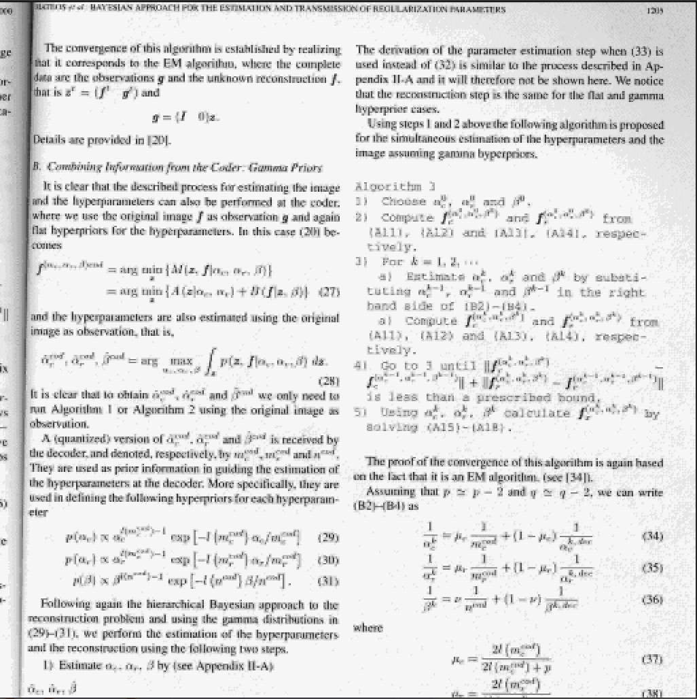

# PGM Image Vector Quantizer 

## Description

This repo contains an implementation of a vector quantizer for PGM
images. The code includes train and test routines for creating and 
using vector quantization codebooks. A simple codebook with its source
training images and some test cases is also included in the repository. 

As of today, the code reads only 8-bits PGM images, and there are 
performance improvements that can be done, as well as some more 
extensive testing.

## Usage

The train and test source files can be compiled to respectively create
and use codebooks in vector quantization.

To use the test routine, compile the `train.c` file, along with the
`imgutil.c`, `kmeans.c`, and `vq.c` source files and the `vq.h` header
file. Training uses all files inside a folder passed as the 
first command-line parameter of the executable, and appends the
codebooks calculated for a set of pre-defined number of clusters and
block sizes.

Without applying any changes to the source code, running
```
train "<training imgs folder>" "<codebook file path>"
```
creates the codebooks for block sizes {1x1, 1x2, 2x2, 2x4, 4x4, 8x4, 8x8}
and {100, 200, 300, 400, 500, 600, 700} clusters. If other params need to 
be used, this setting can be modified on the `train.c` file main function.

Similarly, testing codebooks on a set of images can be done using the
test routine. After compiling the `test.c` file, along with the
`imgutil.c`, `kmeans.c`, and `vq.c` source files and the `vq.h` header,
running
```
test "<codebook path>" "<test folder>" "<out folder>" "<log path>"
```
will quantize all images in the test folder using all the codebooks
of the file in `<codebook path>`. The resulting PGM images will be
written in the output folder, and peak signal-to-noise ratio (PSNR) 
and rate in bits/pixel will be logged in the end of the file in `<log path>`.

## Implementation

This implementation of vector quantization is quite straightforward.
First, input images are read using the utility functions in `imgutil.c`.
Then, they are divided in blocks with the functions of `vq.c`. The 
functions in this C source file also bridge the codebook and the new 
quantized image that is written in the test routine.

Finally, after dividing the images in blocks, the `calculateCentroids`
and `assignCentroids` in the `kmeans.c` file are responsible for 
calculating centroids (in the training case) and attributing blocks
to clusters (in the test case). For training, K-Means is performed
only once by grouping all images in a list of blocks.

The K-Means algorithm that was implemented for obtaining the centroids
has the following steps:

1. Select K random points as centroids
2. Assign all points to a centroid using euclidean distance
3. Replace empty cluster centroids by points belonging to the largest cluster
4. Update centroids as the rounded mean of all points in the cluster
5. Go back to step two, unless the mean difference between the updated centroids and the previous ones is smaller than 5%, or if more than 40 iterations are complete.

The rate vs. distortion curve for the test images with the codebook provided is below:

<p align="center">
    
</p>

It is possible to see that the PSNR increases with the rate, as expected.
This can be either a consequence of using more centroids, or using smaller blocks.
As an example, below are three versions of the `cameraman` image using
500 clusters, and blocks of sizes 2x2, 4x4, and 8x8. Their PSNRs and rates
are: (32.92,2.24), (25.91,0.56), and (22.35,0.14).

<p align="center">
    
    
    
</p>

Similarly, below are the quantizations of the `gold` image using blocks of 2x2, and 
using 200, 400, and 600 clusters. The PSNRs and rates are: (33.83,1.91), (35.23,2.16),
and (36.03,2.31).

<p align="center">
    
    
    
</p>

The worst results were obtained for the `pp1205` image, where it is hard to distinguish
the sentences in the paper. Below, a quantized version with 2x2 blocks and 800 clusters. 
PSNR and rate are (28.98,2.41).

<p align="center">
    
</p>

## Credits

This project is a part of the Image Compression course of PEE/Coppe and so I would like to thank professor Eduardo A.B. da Silva.

## License

This project is licensed under the GNU General Public License v3.0


